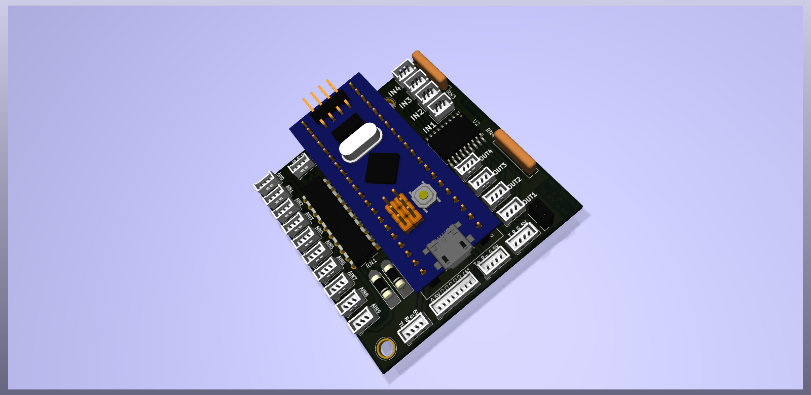

# ControleMix
Circuito universal para construção de robos autonomos ou radiocontrolado

# **Resumo**

O Controle Mix é uma placa dedicada para a construção, desenvolvimento e prototipagem de robôs autônomos ou controlado, o foco dela é para robôs voltados a competição (mas isso não impede que a mesma seja usada em outros robôs ou em outras aplicações )

## **Circuito**
 
O circuito leva o [STM32F103C8T6](https://www.st.com/content/ccc/resource/technical/document/reference_manual/59/b9/ba/7f/11/af/43/d5/CD00171190.pdf/files/CD00171190.pdf/jcr:content/translations/en.CD00171190.pdf
) na plataforma  [Blue pill](https://www.techshopbd.com/uploads/product_document/STM32bluepillarduinoguide(1).pdf) a mesma dispõe de entradas e saídas e interfaces de comunicação serial , a ideia principal é universalizar os projetos e principalmente facilitar o projeto elétrico de forma que o desenvolvimento seja mais voltado para a programação. O circuito foi desenvolvido no Kicad e está projetado para fabricação manufatura ([consulte o GERBER](./DOC/GERBER/)), Para mais informações da placa consulte o [esquema elétrico](./DOC/ControleMix.pdf), O circuito contém:

* 10 entradas analogicas de 12 bits com divisor de tensão - 0V a 30V

* 4 saídas acoplada por um [ULN2803A](https://www.st.com/en/interfaces-and-transceivers/uln2803a.html)   (todas PWM)

* 4 Entradas acoplada por um  [ULN2803A](https://www.st.com/en/interfaces-and-transceivers/uln2803a.html)   (todas PWM)

* Serial USART1

* Serial USART3 / I2C2

* Serial USB / CAN

* Conector para mix de sinal do controle RF de até 6 canais

 
## **Notas para instalação e manipulação nos projetos:**

* sempre consulte o [esquema elétrico](./DOC/ControleMix.pdf).

* Ela tem aproximadamente 60mm por 60mm e contém 2 furos de fixação excêntrico e assimétricos.

* Aconselha se a utilizar de forma que o circuito não fique exposto, ela é utiliza  conectores [molex de passo 1.27mm](
https://www.molex.com/molex/news/display_news.jsp?channel=New&channelId=0&oid=941
)

* Os resistores do divisor de divisão de tensão e os resistores de pull up são array de resistores embora pode ser facilmente substituídos por resistores comuns

* Para desenho do projeto em [3D](./DOC/3D/) consulte o D do circuito 

